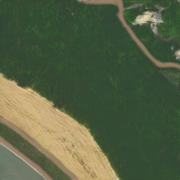
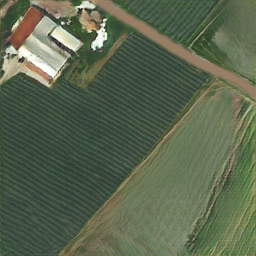

# Internship at CIRAD 
## Partie 1 : Unet Implémentation
UNet implémentation sur des images satellites labelisées  

### Requirements

Python 3
<br>
NVIDIA GPU avec un support CUDA 10 

```code
pip install -r requirements.txt
```

Autres libraries:

* keras >= 2.2.0 or tensorflow >= 1.13
* albumentations==0.3.0
* segmentation-models==1.0.*

**Install Segmentation Models**

```code
 pip install git+https://github.com/qubvel/segmentation_models
```

### Structure du Projet
    .
    ├──augmentation.py: modules pour l'augmentation des données.
    ├──data_loader.py: 
    ├──expe_real.ipynb: 2 expe for le model train on real images
    ├──expe_synthese.ipynb: 2 expe for the model train sur les images de syntheses.
    ├──utils.py: Module with auxiliary functions.
    └──requirements.txt: 

### How to Use

A call must be made to the main module, passing it the arguments corresponding to the dataset paths and the training parameters.

### Dataset

the data used are little satellites images of 512*512 pixels from the Hautes Alpes french department 
The data for "the synthese dataset" has been created from the same dataset.
## Partie2 : Experimentation et benchmark de plusieures réseaux à l'aide de MMSegmentation

Installation de MMSegmentation

Prérequis:

- gcc
- nvcc
- python3
- pip
1. Création d’un environnement python 

```bash
pip -m venv <PATH_TO_ENV>
```

2. Installation de la bonne version Pytorch compatible avec cuda 10.2

```bash
pip install torch==1.11.0+cu102 torchvision==0.12.0+cu102 torchaudio==0.11.0 --extra-index-url https://download.pytorch.org/whl/cu102
```

3. Installation de la bonne version mmcv compatible avec cuda 10.2 et pytorch 11.1

Toutes les versions et compatibilités sont disponibles au lien [suivant](https://mmcv.readthedocs.io/en/latest/get_started/installation.html)

```bash
pip install mmcv-full==1.5.3 -f https://download.openmmlab.com/mmcv/dist/cu102/torch1.11.0/index.html
```

4. Téléchargement du repository mmsegmentation et installation

```bash
git clone https://github.com/open-mmlab/mmsegmentation.git 
cd mmsegmentation
pip install -e .
```

5. Vérification

```bash
#### Check Pytorch installation
import torch, torchvision
print(torch.__version__, torch.cuda.is_available())

#### Check MMSegmentation installation
import mmseg
print(mmseg.__version__)

#### Check mmcv installation
import mmcv
print(mmcv.__version__)
```


6. Pour toutes infos complémentaires sur comment mettre en place les modèles voir le lien [suivant](https://github.com/open-mmlab/mmsegmentation/tree/master/docs/en/tutorials)


## Partie 3 : Génération d'images satellite par le réseau GAN OASIS
Nous utilisons dans cette partie le réseau [GAN Oasis](https://arxiv.org/pdf/2012.04781.pdf) 

### Setup
cloner le repository suivant:
```
git clone https://github.com/boschresearch/OASIS.git
cd OASIS
```

```
pip -m venv <PATH_TO_ENV>
pip install -r requirements.txt
```
### Datasets

Le jeu de donnée doit respecter le format courant du type CityscapeDataset

### Entraînement du modèle

```
python train.py --name AmpliGAN --batch_size 12 --dataroot Real/ --dataset_mode custom --num_workers 4
```

### Test du modèle
La commande suivante va générer des images en sortie à partir d'un jeu de label, ainsi qu'une série de métriques comme le score FID pour l'évaluation du GAN.
```
python test.py --name AmpliGAN --batch_size 12 --dataroot path_to_dataset/ --dataset_mode custom --num_workers 4
```

### Exemples d'images générées en sortie





#### License

This project is open-sourced under the AGPL-3.0 license. See the
[LICENSE](LICENSE) file for details.

For a list of other open source components included in this project, see the
file [3rd-party-licenses.txt](3rd-party-licenses.txt).

 nor monitored in any way.
 
### Autres informations

Pour de plus amples informations je vous invite à lire le rapport donné en [pdf](https://github.com/hugomtr/Satellite-Image-Segmentation/blob/master/Stage_Rapport__Version_792__1_%20(2)-compress%C3%A9.pdf)
