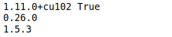

# MMSegmentation

Installation de MMSegmentation

Prérequis:

- gcc
- nvcc
- python3
- pip
1. Création d’un environnement python 

```bash
pip -m venv <PATH_TO_ENV>
```

2. Installation de la bonne version Pytorch compatible avec cuda 10.2

```bash
pip install torch==1.11.0+cu102 torchvision==0.12.0+cu102 torchaudio==0.11.0 --extra-index-url https://download.pytorch.org/whl/cu102
```

3. Installation de la bonne version mmcv compatible avec cuda 10.2 et pytorch 11.1

Toutes les versions et compatibilités sont disponibles au lien [suivant](https://mmcv.readthedocs.io/en/latest/get_started/installation.html)

```bash
pip install mmcv-full==1.5.3 -f https://download.openmmlab.com/mmcv/dist/cu102/torch1.11.0/index.html
```

4. Téléchargement du repository mmsegmentation et installation

```bash
git clone https://github.com/open-mmlab/mmsegmentation.git 
cd mmsegmentation
pip install -e .
```

5. Vérification

```bash
# Check Pytorch installation
import torch, torchvision
print(torch.__version__, torch.cuda.is_available())

# Check MMSegmentation installation
import mmseg
print(mmseg.__version__)

# Check mmcv installation
import mmcv
print(mmcv.__version__)
```



6. Pour toutes infos complémentaires sur comment mettre en place les modèles voir le lien [suivant](https://github.com/open-mmlab/mmsegmentation/tree/master/docs/en/tutorials)
